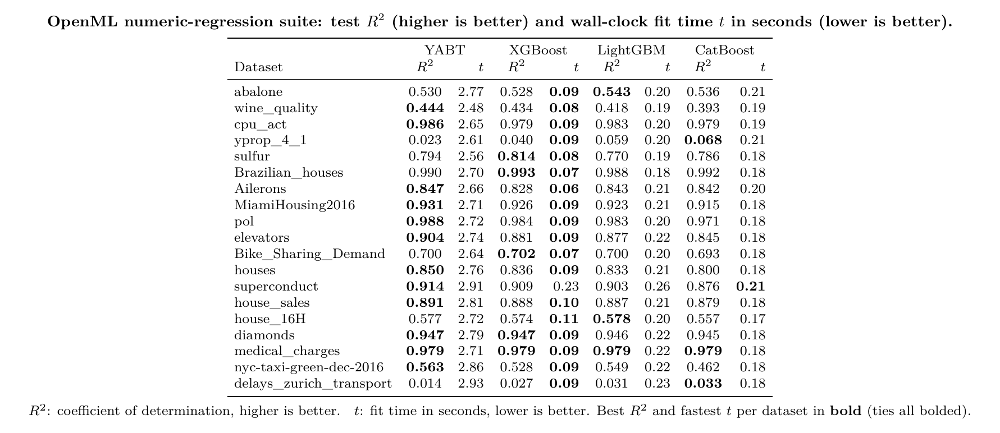

# YABT: Yet Another Boosting Tree

YABT is a GPU-accelerated gradient boosting library. Like XGBoost or
LightGBM, it trains a sequence of small decision trees where each tree
corrects the mistakes of the ones before it. The difference is what YABT does
to each tree once it is built: it replaces each leaf's constant output with a
small learned model, and can optionally fine-tune the split points with
gradient descent (the same method used to train neural networks) so they land
on better values.

It exposes the scikit-learn API (`fit` / `predict` / `predict_proba`) and
works as a drop-in replacement for XGBoost/LightGBM-style estimators.

> **Experimental.** YABT is a research project, not a production library. Its
> main known limitation is **speed**: training is slower than mature GBDTs like
> XGBoost or LightGBM (see [Performance vs XGBoost](#performance-vs-xgboost)).

## How it works

YABT is gradient boosting: it builds a sequence of trees, each trained to
predict the error (the gradient of the loss) left over by all the trees before
it, and sums their contributions. Each tree is grown fast on the GPU with the
standard histogram method — continuous features are binned into small integer
buckets (0–255), bucketed error sums give a gain score for every candidate
split, and the highest-gain split wins until the leaf or depth budget is hit.
The twist is what sits in each leaf: instead of a single constant, YABT can use
neural leaves — a small linear model over the most useful features, so a leaf
captures trends inside its region (on by default, it helps at near-equal cost) —
and optionally refinement, which treats thresholds and leaf values as tunable
weights and takes a few gradient-descent steps off the coarse bin edges (off by
default via `refine_steps > 0`, since A/B tests show ~10% more training time for
negligible-to-negative accuracy gain). Then the next tree starts on the error
that is still left, and the loop repeats.

## Optional features

YABT ships several extra features you can toggle. Each was A/B-tested; the
sections below have the details and the measured trade-offs.

| Feature | Flag | Default | Summary |
|---|---|---|---|
| Neural leaves | `neural_leaves` | on | small per-leaf model instead of a constant |
| Interaction-aware splits | `interaction_aware` | on (n≥2000) | learned feature interactions steer tree growth |
| Product features | `product_features` | off | auto-built feature products for multiplicative targets |
| Differentiable refinement | `refine_steps` | off | gradient-descent polish of splits and leaves (set `refine_steps>0`) |
| Kernel splits | `kernel_splits` | off | non-linear RBF "blob" splits at a node |
| Stochastic routing | `stochastic_routing` | off | smooth, probabilistic predictions |
| Auto-tuning | `auto_tune` | off | picks hyperparameters per dataset before fitting |
| Adaptive features | `adaptive_features` | off | feature importance learned during training |
| GOSS sampling | `goss_enabled` | off | keep big-error rows, subsample the rest |
| Multi-task | `YABTMultiTaskRegressor` | | one shared tree structure across many targets |

## Installation

With [uv](https://docs.astral.sh/uv/) (recommended):

```bash
uv sync
```

Or with pip:

```bash
pip install -e .
```

## Example

```python
from yabt import YABTClassifier
from sklearn.datasets import load_breast_cancer
from sklearn.model_selection import train_test_split

X, y = load_breast_cancer(return_X_y=True)
X_train, X_test, y_train, y_test = train_test_split(X, y, test_size=0.2)

clf = YABTClassifier(
    n_estimators=200,
    learning_rate=0.1,
    refine_steps=10,        # differentiable threshold refinement
    adaptive_features=True, # learned feature importance
    goss_enabled=True,      # gradient-based sampling
)
clf.fit(X_train, y_train)
proba = clf.predict_proba(X_test)
```

See `benchmarks/` for accuracy and speed comparisons against XGBoost,
LightGBM, and CatBoost.

## Performance vs XGBoost

YABT's per-tree work is heavier than a plain GBDT: each tree gets per-leaf
linear models and (optionally) interaction steering. With matched settings
(200 trees, 31 leaves) a YABT tree is therefore several times slower to build
than an XGBoost `hist` tree. The flip side is that each tree is *stronger*, so
YABT reaches the same accuracy with far fewer trees:

- On a 20k-row, 20-feature regression, YABT matches XGBoost's 200-tree R² with
  about 25 trees (and keeps climbing past it), so at iso-accuracy it trains in
  the same ballpark wall-clock, not 10x slower.
- It is consistently a touch more accurate at equal tree counts (+0.01 to +0.02
  R² in the examples above), which is the trade YABT is built to make: spend
  compute per tree to need fewer of them.

Training is also fully vectorized on the GPU (`device="auto"` uses CUDA when
available, with the level-wise grower batching the per-depth work). XGBoost's
hand-tuned CUDA kernels are still faster per tree, but the gap narrows on
larger data while YABT stays ahead on accuracy.

Practical guidance: with neural leaves doing more per tree, you usually want a
*lower* `n_estimators` than you would give XGBoost. Start around 50-100 and add
an `eval_set` with `early_stopping_rounds` rather than defaulting to many
hundreds of trees.

## Benchmark results

On the numeric-regression suite from Grinsztajn et al. (2022) — 19 OpenML
datasets, all four libraries run with matched defaults (100 trees, lr 0.1,
depth 6) on the same GPU — YABT has the best test $R^2$ on most datasets, at
the cost of higher per-tree wall-clock time:



### Reproducing the numbers

The table is rendered from `benchmarks/openml_benchmark_results.json`, which is
produced by the benchmark harness. From the `benchmarks/` directory:

```bash
python openml_benchmark.py --suite num_reg --seeds 3 --device gpu
```

This loads each dataset, runs every library over three train/test splits, and
writes the mean $R^2$ and fit time per model back to the JSON (use
`--device cpu` if you have no CUDA device; `--list` shows the datasets). The
figure is a LaTeX rendering of that JSON.

## Kernel-based splits

In addition to the usual axis-aligned splits (`x[f] <= t`), YABT can split
nodes by RBF similarity to a landmark point sampled from the node's own rows:
`exp(-gamma * ||x - c||^2) <= t`. This carves out spherical regions in
scale-normalized feature space, so a single split can capture structure that
axis-aligned trees need many splits to approximate. At each node both split
types compete on the same Newton gain criterion and the better one wins.

```python
clf = YABTClassifier(
    kernel_splits=True,      # enable RBF landmark splits (off by default)
    kernel_candidates=8,     # landmarks sampled per node
    kernel_gamma=0.0,        # RBF bandwidth; 0 = median-distance heuristic
    kernel_min_samples=64,   # only try kernel splits on nodes this large
)
```

`kernel_importance_weighting` ("node" or "ema") additionally weights the
distance by per-feature split gain, so important features dominate it. This
is experimental and off by default: in our A/B tests neither variant beat the
uniform distance, because gain-adaptive distances tend to select kernel
splits whose in-sample advantage does not generalize.

On a noisy XOR problem with depth-1 trees, axis-aligned boosting stays at
chance (about 50% accuracy, since the target is not additive in the features)
while kernel splits reach about 95%.

## Neural leaf networks

Instead of a constant value, each sufficiently populated leaf can hold a small
model over the tree's most informative features, fitted to the boosting Newton
objective at the current ensemble margin, so each leaf captures the residual
structure within its region. `leaf_net_hidden=0` (default) fits a closed-form
ridge-linear model per leaf; `>0` trains a small tanh MLP per leaf.

```python
reg = YABTRegressor(
    neural_leaves=True,      # per-leaf models (ON by default; set False to disable)
    leaf_net_hidden=0,       # 0 = ridge-linear leaves; >0 = tanh MLP width
    leaf_net_features=8,     # net inputs: top split features + strongest rest
    leaf_net_min_samples=50, # smaller leaves keep their constant value
)
```

Linear leaves match or beat constant leaves at near-equal training cost, with
the largest gains at small tree budgets (+2 to +3 points of accuracy/R² at 25
trees on california/digits in our A/Bs). The MLP variant did not outperform
linear leaves in benchmarks and trains several times slower, so prefer
`leaf_net_hidden=0` unless you are experimenting.

## Stochastic routing

Trees are trained with hard routing as usual, but at inference each internal
node can route probabilistically: a row goes left with probability
`sigmoid((threshold - x) / (tau * scale))`, and the prediction is the exact
expectation over all root-to-leaf paths. The result is a smooth (and
differentiable-in-x) prediction function instead of a piecewise-constant one.

```python
reg = YABTRegressor(
    stochastic_routing=True,  # soft inference (off by default)
    routing_tau=0.05,         # gate width relative to the feature's scale
)
```

In our A/Bs this helps on smooth or noisy targets (+1.5 accuracy points and
better log loss on a synthetic 30-dim task, +0.6 R² on Friedman #1) and hurts
when the target has genuine discontinuities (california housing, digits). So
it is off by default and worth a try when you believe the underlying function
is smooth, or when you need continuous/differentiable predictions downstream.
Soft inference costs roughly 3x hard inference (still milliseconds).

## Interaction-aware splits

YABT learns a feature-interaction matrix during training from
ancestor-descendant split pairs on tree paths (a split on B underneath a split
on A means B's effect is conditioned on A). With `interaction_aware=True`,
that matrix steers later tree growth: at each node, features that historically
interact with the features already on the node's path get a selection boost
capped at `1 + interaction_boost`. The boost only flips near-ties (split
acceptance and leaf ordering always use the true unboosted gain) and
interaction counts are measured against the background rate, so uniform noise
produces no steering.

```python
reg = YABTRegressor(
    interaction_aware=True,  # learned interactions guide growth (ON by default, n>=2000)
    interaction_boost=0.5,   # selection boost cap; try 1.0 for interaction-heavy data
)
```

In our A/Bs this is the strongest of the novel features on tabular data: +5 R²
points on a products-of-features regression in 30 dims, +1.2 accuracy points
on a 30-dim classification benchmark, small wins on friedman1/california, and
a -0.2 point cost on digits (which has no real feature interactions). Overhead
is about 10 to 20% training time. The learned pairs are also exposed directly
via `model.booster_.top_interactions(k)`.

It is automatically disabled for datasets under 2000 rows, where the
interaction counts are too noisy to trust and steering hurts more than it
helps (-2.5 R² points on a 442-row benchmark in our A/Bs). The
`interaction_aware=True` default still reflects this gate: it turns on once the
dataset is large enough.

## Auto-tuning

With `auto_tune=True`, YABT picks per-dataset hyperparameters before the final
fit via a bounded validation search over a small curated candidate set
(informed by the A/B results above, e.g. constant leaves for sharp-boundary
data, slower/deeper vs faster/shallower, stronger interaction boost). Each
candidate is scored on a held-out split at the deployment tree count, and the
winner is refit on all the data.

```python
clf = YABTClassifier(
    n_estimators=200,
    auto_tune=True,   # validation search before the final fit (off by default)
)
clf.fit(X, y)
print(clf.booster_.tuning_report_["selected"])  # which candidate won
```

This is a bounded search (a handful of fits), not an open-ended sweep, and it
is skipped automatically for datasets under 600 rows where a validation split
is too noisy to trust. In our A/Bs it improves or matches the default
everywhere (california +0.4 R², synthetic 30-dim +1.3 accuracy points,
friedman1/digits correctly left at the default) at a cost of roughly one fit
per candidate. Pass your own `eval_set` and it tunes against that instead of
an internal split. The chosen configuration is reported on
`booster_.tuning_report_`.

## Multi-task learning

`YABTMultiTaskRegressor` predicts several targets at once by growing one
shared tree structure for all of them: each split is chosen on the summed
per-target gain, and every leaf stores a value per target. Correlated targets
transfer through common splits and regularize one another; unrelated targets
fall back to roughly independent fits.

```python
from yabt import YABTMultiTaskRegressor

reg = YABTMultiTaskRegressor(n_estimators=200, max_leaves=16)
reg.fit(X, Y)          # Y is (n_samples, n_targets)
P = reg.predict(X)     # (n_samples, n_targets)
```

The structural sharing buys two things. First, efficiency: one model of
`n_estimators` trees instead of one model per target, about 3x faster to train
and 8x fewer trees on an 8-target problem, with proportional inference
savings. Second, accuracy in the data-scarce regime: when training data is
limited relative to the number of correlated targets, sharing splits acts as
regularization (+0.5 to +0.9 R² points across 4-8 correlated targets at a few
hundred rows in our A/Bs, growing with the number of targets). With abundant
data the shared structure is a mild constraint and independent models edge
ahead by a fraction of a point, and on uncorrelated targets the two are within
noise, so multi-task is the right tool when targets are related and data or
compute is the bottleneck. Numeric features only; the single-task extras
(kernel splits, neural leaves, soft routing, interaction-aware growth) do not
apply to this path.

## Parameters

All hyperparameters are passed as keyword arguments to the estimator
constructors (`YABTClassifier`, `YABTRegressor`, `YABTMultiTaskRegressor`).
`YABTMultiTaskRegressor` honors only the **Core tree / boosting** params plus
`early_stopping_rounds`, `seed`, and `device`; the single-task extras below do
not apply to its shared-structure path.

| Parameter | Default | Description |
|---|---|---|
| **Core tree / boosting** | | |
| `n_estimators` | `500` | Number of boosting iterations (trees). |
| `learning_rate` | `0.1` | Shrinkage applied to each tree's contribution. |
| `max_leaves` | `31` | Maximum number of leaves per tree. |
| `max_depth` | `64` | Maximum tree depth. |
| `reg_lambda` | `1.0` | L2 regularization on leaf weights. |
| `gamma` | `0.0` | Minimum loss reduction required to make a split. |
| `min_child_weight` | `1e-3` | Minimum sum of Hessian (instance weight) allowed in a child. |
| `min_samples_leaf` | `20` | Minimum number of samples per leaf. |
| `subsample` | `1.0` | Row subsampling ratio drawn per tree. |
| `colsample` | `1.0` | Column (feature) subsampling ratio per tree. |
| `max_bins` | `256` | Number of histogram bins used to discretize features. |
| **Differentiable refinement** | | |
| `refine_steps` | `0` | Gradient-descent refinement steps applied to splits and leaves after each tree (0 disables; effective steps adapt to dataset size). Off by default: costs ~10% of fit time for negligible gain on real tabular data. Opt in with `refine_steps > 0`. |
| `refine_lr` | `0.02` | Learning rate for differentiable refinement. |
| `refine_min_gain` | `1e-4` | Skip refinement when the loss is already below this threshold. |
| `refit_every` | `0` | Refit all leaf values across the ensemble every N trees (0 disables). |
| `refit_steps` | `30` | Gradient steps per ensemble refit. |
| `refit_lr` | `0.05` | Learning rate for ensemble refit. |
| **Adaptive features & sampling** | | |
| `adaptive_features` | `False` | Learn feature importances during training and bias sampling toward them. |
| `feature_importance_alpha` | `0.1` | EMA smoothing factor for the learned feature importances. |
| `goss_enabled` | `False` | Gradient-based One-Side Sampling: keep large-gradient rows and subsample the rest. |
| `goss_ratio` | `0.9` | Fraction of large-gradient rows retained when GOSS is enabled. |
| **Interaction-aware growth** | | |
| `detect_interactions` | `False` | Track which feature pairs interact during training. |
| `interaction_aware` | `True` | Steer split selection toward features that interact with those already on the node's path. Only flips near-ties and never inflates the gain used to accept a split. On by default (A/B-verified on tabular data). |
| `interaction_boost` | `0.5` | Maximum multiplicative boost (capped at `1 + interaction_boost`) applied to near-tie gains by interaction steering. |
| **Product features** | | |
| `product_features` | `False` | Detect feature groups that drive the residual multiplicatively (via the magnitude signal corr(x^2, r^2)) and append their products as columns before training, so the greedy splitter can use interactions like x_i*x_j*x_k that have no marginal gain. A correlation guard keeps a product only when it beats its components, so data without multiplicative structure is left untouched. Off by default (A/B: large win on multiplicative targets, neutral elsewhere). |
| `product_max_features` | `5` | Number of top magnitude-signal features scanned for products. |
| `product_max_order` | `3` | Highest product order considered (3 = up to triple products). |
| `product_min_corr` | `0.03` | Absolute residual-correlation floor for a product to be kept. |
| `product_corr_gain` | `1.3` | A product is kept only if its residual correlation exceeds this factor times the best correlation of its component features. |
| **Kernel splits** | | |
| `kernel_splits` | `False` | Enable RBF landmark ("blob") splits for non-linear boundaries. |
| `kernel_candidates` | `8` | Number of candidate landmarks evaluated per node. |
| `kernel_gamma` | `0.0` | RBF bandwidth; 0 uses a per-landmark median-distance heuristic. |
| `kernel_min_samples` | `64` | Minimum node size for a kernel split to be considered. |
| `kernel_importance_weighting` | `False` | EXPERIMENTAL. Weight kernel distances by per-feature split gain. False = uniform (best overall in A/B tests); "node" / True = gains of the node being split; "ema" = EMA of root-level gains from previous iterations. |
| **Neural leaves** | | |
| `neural_leaves` | `True` | Fit a small per-leaf model instead of a constant value. On by default (linear leaves A/B-verified to win or tie at ~equal cost). |
| `leaf_net_hidden` | `0` | Hidden width; 0 = ridge-linear leaves, >0 = tanh MLP of this width. |
| `leaf_net_features` | `8` | Number of top tree-split features used as leaf-model inputs. |
| `leaf_net_l2` | `1.0` | L2 regularization for the leaf models. |
| `leaf_net_steps` | `40` | Adam steps per tree (MLP leaves only). |
| `leaf_net_lr` | `0.05` | Adam learning rate (MLP leaves only). |
| `leaf_net_min_samples` | `50` | Leaves smaller than this keep their constant value. |
| **Auto-tuning** | | |
| `auto_tune` | `False` | Search curated hyperparameter candidates on a validation split before the final fit (skipped for datasets with < 600 rows). |
| **Stochastic routing** | | |
| `stochastic_routing` | `False` | Use soft (expected-path) routing at inference; trees are still grown and trained hard, but predictions become smooth in X. |
| `routing_tau` | `0.05` | Gate width as a fraction of the split feature's scale. |
| **Growth strategy** | | |
| `levelwise` | `"auto"` | Breadth-first (level-wise) growth with sibling subtraction. "auto" enables it on CUDA when `max_leaves >= 16` (~1.8x faster), otherwise uses the best-first heap grower; it also falls back to the heap below 16 leaves or when `kernel_splits` is on. True/False force it on/off (True still skips kernel splits). |
| `numba_grower` | `"auto"` | Use the Numba-JIT compiled best-first grower on CPU (1.5-4x faster than the torch grower at identical accuracy). "auto" enables it on CPU for the axis-split path; it falls back to the torch grower on CUDA, on the level-wise path, or when `kernel_splits` is on. True/False force it on/off (True still falls back where unsupported). |
| `sparse_hist` | `"auto"` | Sparse histogram build for the Numba grower: store each feature's non-modal bins and fill the modal bin by subtraction, making a histogram cost O(node_nnz + F) instead of O(node_rows * F). The win is on wide, sparse data (e.g. ~1.3x on Santander, 4991 features 97% zero), accuracy-neutral. "auto" uses it only when the data is dense enough below `sparse_hist_max_density` and rows are not subsampled; True/False force it (still requires the Numba grower). |
| `sparse_hist_max_density` | `0.5` | Max fraction of explicitly-stored cells for "auto" `sparse_hist` to engage; above this the dense builder is used (no sparsity to exploit). |
| **Training control** | | |
| `early_stopping_rounds` | `0` | Stop if the eval metric does not improve for this many rounds (0 disables; requires `eval_set` to be passed to `fit`). |
| `seed` | `0` | Random seed. |
| `device` | `"auto"` | "auto" picks "cuda" when available, else "cpu"; may also be set to "cuda" or "cpu" explicitly. |
| `verbose` | `False` | Print per-iteration training progress. |
| `cat_smoothing` | `10.0` | Smoothing strength for the leakage-free target encoding of categorical columns (selected via the `categorical_features` argument to `fit`). |

## License

MIT — see the [LICENSE](LICENSE) file for details.
